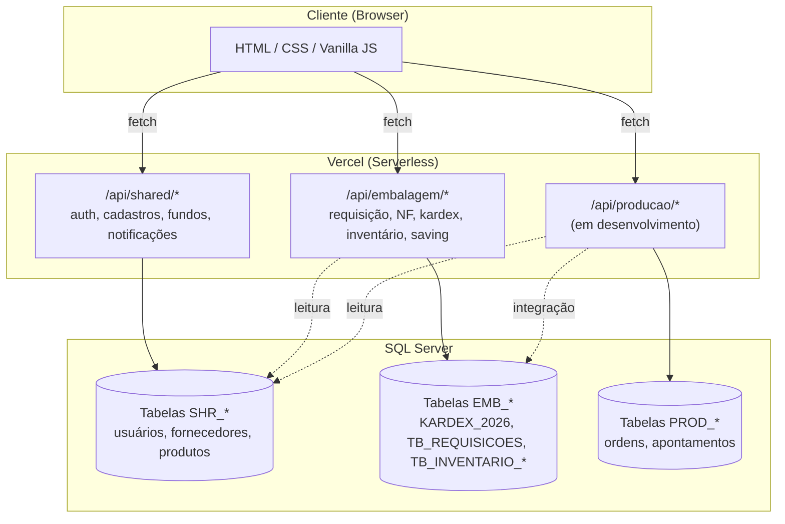
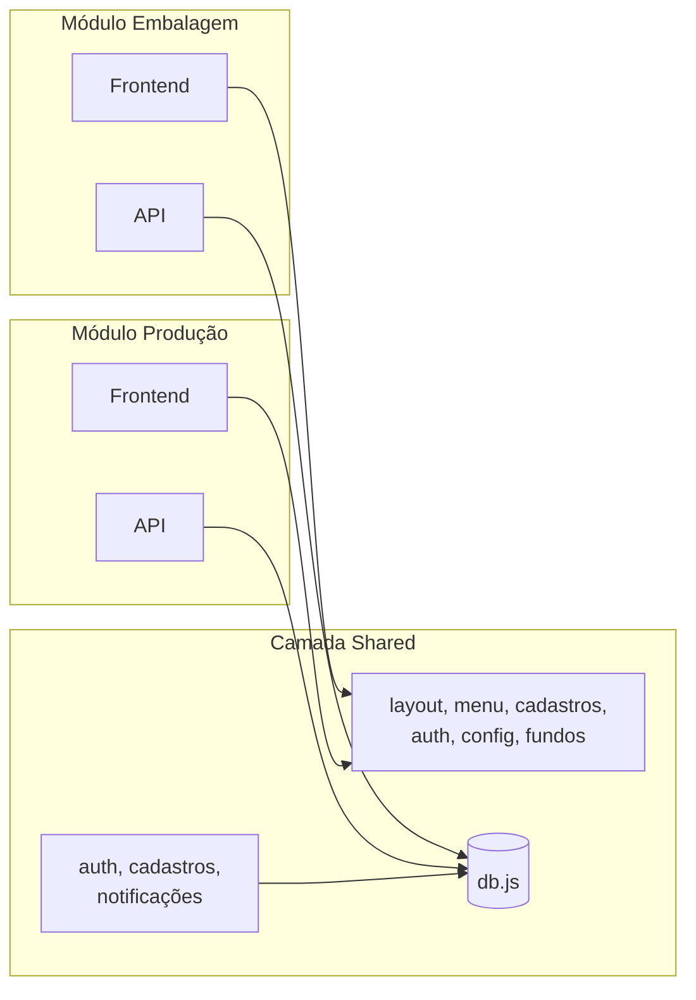
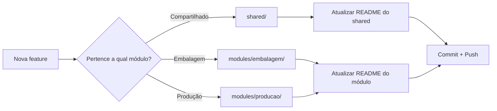

# SGC — Sistema de Gestão Customic

> Documento de arquitetura geral do projeto.
> **Última atualização:** 21/05/2026

---

## 1. Visão Geral

O **SGC** é uma plataforma web modular para gestão industrial da Customic.
A plataforma é organizada em **módulos de negócio independentes**, que compartilham
infraestrutura comum (autenticação, cadastros, layout, banco de dados).

### Módulos atuais e planejados

| Módulo | Status | Escopo |
|--------|--------|--------|
| 📦 **Embalagem** | ✅ Em produção | Requisições, Kardex, Estoque, NF, Inventário Cíclico, Relatórios |
| 🏭 **Produção** | 🚧 Em desenvolvimento | PCP, Ordens de Produção, Apontamentos, MES, APS, Expedição, OEE, Aderência ao Planejado |

---

## 2. Arquitetura de Alto Nível



### Stack Técnica

- **Frontend:** Vanilla JavaScript, HTML5, CSS3 (sem framework). Páginas `.html` independentes.
- **Backend:** Node.js Serverless Functions (Vercel), padrão `export default async function handler(req, res)`.
- **Banco de Dados:** SQL Server, acessado via biblioteca `mssql` com pool de conexões em [db.js](db.js).
- **Deploy:** Vercel, configurado em `vercel.json` (rotas `/api/**`).
- **Autenticação:** Sessão simples via `localStorage` (`userName`), validada pelo backend.

---

## 3. Estrutura de Pastas (Alvo)

```
requisicoes/
├── ARCHITECTURE.md              ← este documento
├── README.md                    ← visão geral / como rodar
├── package.json
├── vercel.json
├── db.js                        ← pool SQL compartilhado (raiz por simplicidade)
│
├── shared/                      ← código transversal (todos os módulos)
│   ├── frontend/
│   │   ├── layout.js
│   │   ├── menu-lateral.html
│   │   ├── style.css
│   │   ├── script.js
│   │   └── fundos.js
│   ├── auth/
│   │   └── index.html           ← login
│   ├── cadastros/
│   │   ├── cadastros.html
│   │   ├── cadastroUsuarios.{html,js}
│   │   ├── cadastroFornecedores.{html,js}
│   │   └── cadastroProdutos.{html,js}
│   ├── config/
│   │   ├── configuracoes.html
│   │   └── configNotificacoes.{html,js}
│   └── menu.html                ← hub de seleção de módulos
│
├── modules/
│   ├── embalagem/
│   │   ├── README.md            ← documentação do módulo
│   │   ├── menu-embalagem.html  ← submenu lateral do módulo
│   │   ├── requisicoes/         ← novaRequisicao, requisicoes, consulta, detalhes
│   │   ├── kardex/              ← estoque, consumoMedio, saidaRapida
│   │   ├── nf/                  ← lancamentoNF, statusNF
│   │   ├── inventario/          ← inventarioCiclico, configInventario
│   │   ├── saving/              ← savingCompras (metas redução curva A)
│   │   └── relatorios/          ← relatorio* (todos)
│   │
│   └── producao/
│       ├── README.md
│       ├── menu-producao.html
│       ├── pcp/
│       ├── ordens/
│       ├── apontamentos/
│       ├── mes/
│       ├── aps/
│       └── expedicao/
│
├── api/
│   ├── shared/
│   │   ├── auth.js
│   │   ├── cadastros.js
│   │   ├── notificacoes.js
│   │   ├── fundos.js
│   │   └── listaTabelas.js
│   ├── embalagem/
│   │   ├── requisicao.js
│   │   ├── inventory.js
│   │   ├── lancamentoNF.js
│   │   ├── statusNF.js
│   │   ├── inventarioCiclico.js
│   │   ├── config.js
│   │   ├── saving.js
│   │   └── relatorios.js
│   └── producao/
│       └── (vazio inicialmente)
│
├── sql/
│   ├── shared/
│   ├── embalagem/               ← scripts SQL atuais migrados
│   └── producao/
│
└── img/                         ← imagens estáticas (login, fundos)
```

> **Nota:** [db.js](db.js) permanece na raiz para que tanto `shared/` quanto qualquer
> módulo possam importá-lo com caminho previsível (`require('../../db.js')`).

---

## 4. Camadas e Responsabilidades



### Regra de ouro
**Módulos NUNCA dependem uns dos outros diretamente.**
Se Produção precisa consumir dados de Embalagem (ex: ler estoque), faz isso via:
1. Endpoint compartilhado em `/api/shared/`, OU
2. Tabela compartilhada do banco (acesso somente leitura).

Nunca via `import` cruzado entre `modules/embalagem/` e `modules/producao/`.

---

## 5. Convenções

### Nomenclatura

| Item | Padrão | Exemplo |
|------|--------|---------|
| Arquivos HTML | `kebab-case` ou `camelCase` (manter atual) | `lancamentoNF.html` |
| Arquivos JS | `camelCase` | `inventoryManagement.js` |
| Tabelas compartilhadas | sem prefixo OU `SHR_` | `CAD_FORNECEDOR`, `TB_USUARIOS` |
| Tabelas Embalagem | `EMB_*` (novas) ou nomes legados | `EMB_REQUISICAO`, `KARDEX_2026` |
| Tabelas Produção | `PROD_*` | `PROD_ORDEM`, `PROD_APONTAMENTO` |
| Endpoints | `/api/{escopo}/{recurso}` | `/api/embalagem/requisicao` |

> **Migração de tabelas legadas:** mantemos os nomes atuais (`TB_REQUISICOES`,
> `KARDEX_2026`, etc.) para não quebrar nada. O prefixo `EMB_` é apenas para
> tabelas **novas** do módulo.

### Estilo de código

- **API:** um handler por endpoint, `switch (req.method)` para dispatch.
- **DB:** queries sempre parametrizadas (`.input('param', sql.Type, value)`).
- **Transações:** `pool.transaction()` para operações multi-etapa.
- **Frontend:** scripts em arquivos separados (não inline), comunicação via `fetch('/api/...')`.

---

## 6. Fluxo de Desenvolvimento



### Adicionando um novo endpoint

1. Identifique o módulo dono do recurso.
2. Crie `api/{escopo}/{nome}.js` com o handler padrão.
3. Importe `db.js` da raiz: `const { getConnection } = require('../../db.js')`.
4. Adicione documentação no README do módulo.

### Adicionando uma nova tela

1. Crie o `.html` em `modules/{escopo}/{categoria}/`.
2. Crie o `.js` correspondente ao lado.
3. Inclua os assets compartilhados:
   ```html
   <link rel="stylesheet" href="/shared/frontend/style.css">
   <script src="/shared/frontend/layout.js"></script>
   ```
4. Adicione link no menu lateral do módulo.

---

## 7. Segurança

- ✅ Queries parametrizadas (proteção contra SQL Injection).
- ✅ Validação de sessão em endpoints sensíveis.
- ⚠️ **A endurecer:** sessão atual é apenas `userName` em `localStorage` — recomenda-se evolução para JWT ou cookie httpOnly.
- ⚠️ **A endurecer:** CORS e rate limiting nos endpoints públicos.

---

## 8. Roadmap de Refatoração

| Fase | Status | Descrição |
|------|--------|-----------|
| **0** | ✅ | Criar `ARCHITECTURE.md` e esqueleto de pastas vazio |
| **1** | ⬜ | Mover arquivos do módulo Embalagem para `modules/embalagem/` |
| **2** | ⬜ | Mover camada compartilhada para `shared/` |
| **3** | ⬜ | Reorganizar `api/` em subpastas (`shared/`, `embalagem/`) |
| **4** | ⬜ | Atualizar todas as referências (`fetch`, `<script>`, `<link>`) |
| **5** | ⬜ | Atualizar `vercel.json` com novas rotas se necessário |
| **6** | ⬜ | Extrair funções utilitárias duplicadas para `shared/frontend/utils.js` |
| **7** | ⬜ | Transformar `menu.html` em hub de seleção de módulos |
| **8** | ⬜ | Criar `modules/embalagem/README.md` completo |
| **9** | ⬜ | Iniciar desenvolvimento do módulo Produção |

> Cada fase deve ser commitada separadamente para facilitar rollback.

---

## 9. Referências Internas

- [README do módulo Embalagem](modules/embalagem/README.md) *(a criar na Fase 8)*
- [README do módulo Produção](modules/producao/README.md) *(a criar)*
- [CHANGELOG_BLOCOS_4_5.md](CHANGELOG_BLOCOS_4_5.md)
- [CHANGELOG_NOTIFICACOES.md](CHANGELOG_NOTIFICACOES.md)
- [Estrutura Tabelas.txt](Estrutura%20Tabelas.txt)
