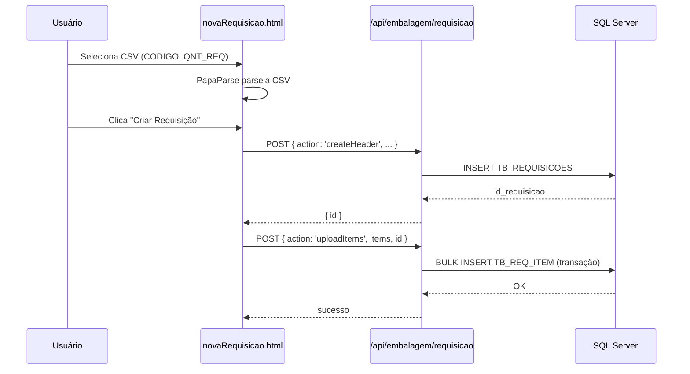
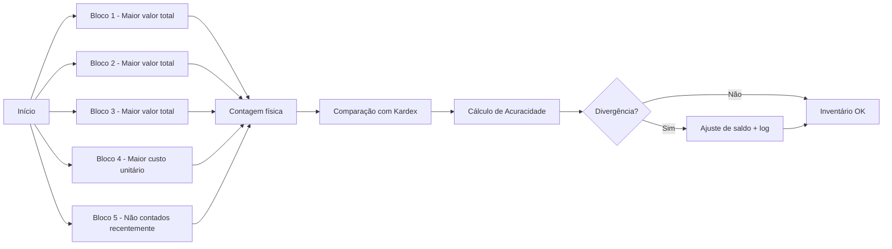
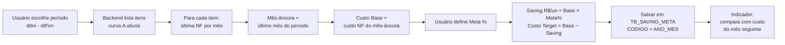

# Módulo Embalagem 📦

> Setor de Embalagem — Requisições, Kardex, Notas Fiscais, Inventário e Relatórios.
> Módulo original do SGC, em produção.
>
> **Última atualização:** 21/05/2026 (pós-Fase 1 da refatoração)

---

## 1. Escopo

- 📝 **Requisições de material** com upload por CSV
- 📦 **Kardex** (movimentação e saldo de estoque)
- 🧾 **Notas Fiscais** (lançamento e status)
- 📋 **Inventário Cíclico** com 5 blocos de prioridade
- 📊 **Relatórios** gerenciais
- ⚡ **Saída Rápida** via QR Code
- 💰 **Saving de Compras** — metas de redução de custo para itens curva A

---

## 2. Estrutura de Arquivos

```
modules/embalagem/
├── requisicoes/   novaRequisicao, requisicoes, consulta, detalhes
├── kardex/        estoque, consumoMedio, saidaRapida, inventoryManagement
├── nf/            lancamentoNF, statusNF (+ statusNF-page.js, NF.frm/frx)
├── inventario/    inventarioCiclico, configInventario
├── saving/        savingCompras (planejamento + indicador planejado x realizado)
└── relatorios/    relatorios, relatorioRequisicoes, relatorioBaixaPorPeriodo,
                   relatorioSaldo, relatorioAcuracidade, relatorioMovimentoDiario
```

---

## 3. Endpoints da API

### Específicos do módulo (`/api/embalagem/`)

| Endpoint | Métodos | Arquivo | Função |
|----------|---------|---------|--------|
| `/api/embalagem/requisicao` | GET, POST, PUT | [api/embalagem/requisicao.js](../../api/embalagem/requisicao.js) | CRUD de requisições + upload CSV |
| `/api/embalagem/inventory` | GET, POST | [api/embalagem/inventory.js](../../api/embalagem/inventory.js) | Movimentações Kardex e saldos |
| `/api/embalagem/lancamentoNF` | GET, POST, PUT | [api/embalagem/lancamentoNF.js](../../api/embalagem/lancamentoNF.js) | Lançamento de notas fiscais |
| `/api/embalagem/statusNF` | GET, POST | [api/embalagem/statusNF.js](../../api/embalagem/statusNF.js) | Status e bipagem de NFs |
| `/api/embalagem/inventarioCiclico` | GET, POST, PUT | [api/embalagem/inventarioCiclico.js](../../api/embalagem/inventarioCiclico.js) | Logs e blocos de inventário |
| `/api/embalagem/relatorios` | GET, POST, DELETE | [api/embalagem/relatorios.js](../../api/embalagem/relatorios.js) | Relatórios consolidados + Saving de Compras (`?acao=savingList`, `savingIndicador`, `savingSaveMetasBatch`, `savingSaveMeta`, `savingDeleteMeta`) |

### Compartilhados (`/api/shared/`)

| Endpoint | Função |
|----------|--------|
| `/api/shared/auth` | Login |
| `/api/shared/cadastros` | Produtos, fornecedores, usuários |
| `/api/shared/config` | Configurações gerais e de inventário |
| `/api/shared/notificacoes` | Notificações |
| `/api/shared/fundos` | Imagens de fundo |
| `/api/shared/listaTabelas` | Diagnóstico SQL |

---

## 4. Tabelas SQL

### Específicas do módulo

| Tabela | Descrição |
|--------|-----------|
| `TB_REQUISICOES` | Cabeçalho das requisições |
| `TB_REQ_ITEM` | Itens das requisições |
| `KARDEX_2026` | Movimentações e saldos de estoque (versionada por ano) |
| `TB_INVENTARIO_CICLICO_LOG` | Histórico de contagens |
| `TB_INVENTARIO_CICLICO_ITEM` | Itens contados |
| `TB_CONFIG_INVENTARIO` | Quantidades por bloco (1–5) |
| `TB_LOG_NF` | Notas fiscais lançadas |
| `TB_STATUS_NF` | Status e bipagem |
| `TB_SAVING_META` | Metas de redução de custo (%) por item e mês-âncora |

### Compartilhadas

| Tabela | Uso |
|--------|-----|
| `TB_USUARIOS` | Login e permissões |
| `CAD_FORNECEDOR` | Cadastro de fornecedores |
| `TB_PRODUTOS` | Cadastro de produtos |
| `TB_NOTIFICACOES` | Sistema de notificações |

> Schema completo: `/memories/repo/database-schema.md`.

---

## 5. Fluxos Principais

### Requisição (Upload CSV)



### Inventário Cíclico (5 Blocos)



> Detalhes em [CHANGELOG_BLOCOS_4_5.md](../../CHANGELOG_BLOCOS_4_5.md).

### Saving de Compras



**Regras:**
- **Itens elegíveis:** `CAD_PROD.CURVA_A_B_C = 'A' AND ATIVO = 1`
- **Custo por mês:** última NF do mês em `NF_PRODUTOS.PROD_CUSTO_FISCAL_MEDIO_NOVO`, ordenada por `NF_CABECALHO.CAB_DT_EMISSAO DESC`.
- **Mês-base (âncora) por item:** mês mais recente do item com NF dentro do período (cada item pode ter um mês diferente — itens sem compras nos meses finais usam o último mês em que houve NF).
- **Meta persistida** em `TB_SAVING_META(CODIGO, ANO_MES)` — granularidade mensal, salva no mês-base de cada item.
- **Saving Realizado:** `CustoBase − CustoUltimaNF(mêsSeguinte ao mês-base)`.
- **Atingimento %:** `SavingRealizado / SavingPlanejado × 100`.

---

## 6. Como Adicionar uma Nova Funcionalidade

1. Identifique a categoria (`requisicoes` / `kardex` / `nf` / `inventario` / `relatorios`).
2. Crie `.html` + `.js` na subpasta correspondente.
3. Estenda ou crie endpoint em `api/embalagem/`.
4. Use `require('../../db.js')` + `getConnection()` — sempre queries parametrizadas.
5. Adicione link em [shared/frontend/menu-lateral.html](../../shared/frontend/menu-lateral.html).
6. Mapeie `idMap` em [shared/frontend/layout.js](../../shared/frontend/layout.js).
7. Atualize este README + commit + push.
