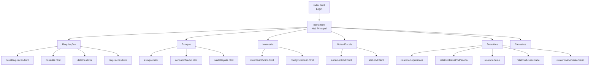
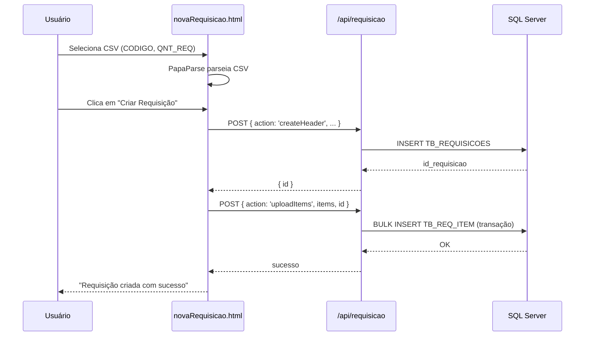
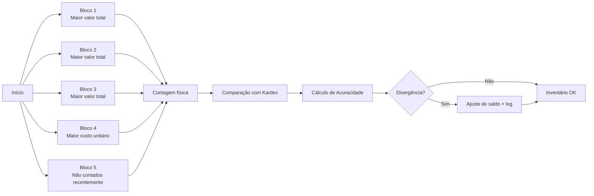

# Módulo Embalagem 📦

> Setor de Embalagem — Requisições, Kardex, Notas Fiscais, Inventário e Relatórios.
> Este é o módulo original do SGC, hoje em produção.

> ⚠️ **Status da reorganização:** os arquivos físicos deste módulo ainda estão na raiz do
> projeto. A migração para `modules/embalagem/` será feita na Fase 1 do roadmap (ver
> [ARCHITECTURE.md](../../ARCHITECTURE.md#8-roadmap-de-refatoração)).

---

## 1. Escopo

O módulo Embalagem cobre todo o fluxo de materiais do setor de embalagem:

- 📝 **Requisições de material** com upload por CSV
- 📦 **Kardex** (movimentação e saldo de estoque)
- 🧾 **Notas Fiscais** (lançamento e status)
- 📋 **Inventário Cíclico** com 5 blocos de prioridade
- 📊 **Relatórios** gerenciais
- ⚡ **Saída Rápida** via QR Code

---

## 2. Mapa de Telas

---

## 3. Endpoints da API

| Endpoint | Métodos | Arquivo | Função |
|----------|---------|---------|--------|
| `/api/auth` | POST | [api/auth.js](../../api/auth.js) | Login / sessão (compartilhado) |
| `/api/requisicao` | GET, POST, PUT | [api/requisicao.js](../../api/requisicao.js) | CRUD de requisições + upload CSV |
| `/api/inventory` | GET, POST | [api/inventory.js](../../api/inventory.js) | Movimentações Kardex e saldos |
| `/api/lancamentoNF` | GET, POST, PUT | [api/lancamentoNF.js](../../api/lancamentoNF.js) | Lançamento de notas fiscais |
| `/api/statusNF` | GET, POST | [api/statusNF.js](../../api/statusNF.js) | Status e bipagem de NFs |
| `/api/inventarioCiclico` | GET, POST, PUT | [api/inventarioCiclico.js](../../api/inventarioCiclico.js) | Logs e blocos de inventário |
| `/api/config` | GET, POST | [api/config.js](../../api/config.js) | Configuração de inventário |
| `/api/relatorios` | GET | [api/relatorios.js](../../api/relatorios.js) | Relatórios consolidados |
| `/api/cadastros` | GET, POST, PUT | [api/cadastros.js](../../api/cadastros.js) | Produtos, fornecedores, usuários (compartilhado) |
| `/api/notificacoes` | GET, POST | [api/notificacoes.js](../../api/notificacoes.js) | Notificações (compartilhado) |
| `/api/fundos` | GET | [api/fundos.js](../../api/fundos.js) | Imagens de fundo (compartilhado) |

---

## 4. Tabelas SQL

### Específicas do módulo

| Tabela | Descrição |
|--------|-----------|
| `TB_REQUISICOES` | Cabeçalho das requisições |
| `TB_REQ_ITEM` | Itens das requisições |
| `KARDEX_2026` | Movimentações e saldos de estoque |
| `TB_INVENTARIO_CICLICO_LOG` | Histórico de contagens |
| `TB_INVENTARIO_CICLICO_ITEM` | Itens contados |
| `TB_CONFIG_INVENTARIO` | Quantidades por bloco (1–5) |
| `TB_LOG_NF` | Notas fiscais lançadas |
| `TB_STATUS_NF` | Status e bipagem |

### Compartilhadas com outros módulos

| Tabela | Uso |
|--------|-----|
| `TB_USUARIOS` | Login e permissões |
| `CAD_FORNECEDOR` | Cadastro de fornecedores |
| `CAD_PRODUTO` | Cadastro de produtos |
| `TB_NOTIFICACOES` | Sistema de notificações |

> Detalhes completos em [Estrutura Tabelas.txt](../../Estrutura%20Tabelas.txt).

---

## 5. Fluxos Principais

### Fluxo de Requisição (Upload CSV)

### Fluxo de Inventário Cíclico (5 Blocos)

> Detalhes em [CHANGELOG_BLOCOS_4_5.md](../../CHANGELOG_BLOCOS_4_5.md).

---

## 6. Como Adicionar uma Nova Funcionalidade

1. Identifique a categoria (requisição / kardex / nf / inventário / relatório).
2. Crie a tela `.html` + `.js` na subpasta correspondente.
3. Crie/estenda o endpoint em `api/`.
4. Use `db.js` (`getConnection()`) para acesso ao banco.
5. Sempre use queries parametrizadas.
6. Adicione link no menu lateral (`menu-lateral.html`).
7. Atualize esta documentação.
8. Commit + push.

---

## 7. Notas Históricas

- O sistema nasceu como "Sistema de Requisições" e evoluiu incorporando Kardex, NF e Inventário.
- A virada para arquitetura multi-módulo aconteceu em **maio/2026** com o início do módulo Produção.
- Convenções e padrões herdados estão consolidados em [.github/copilot-instructions.md](../../.github/copilot-instructions.md).
